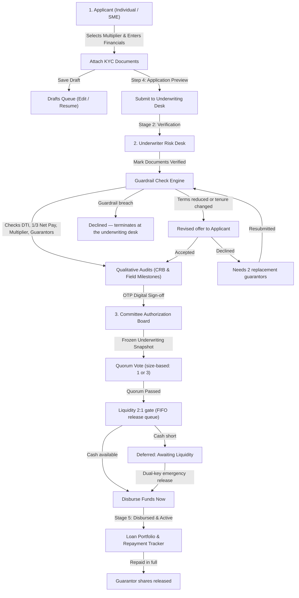

# Talanton Trust Engine — Project & Handover Documentation

**Live Production URL:** [https://talanton-navy.vercel.app](https://talanton-navy.vercel.app)  
**Deployment URL:** [https://talanton-j56albzih-u19059630-3829s-projects.vercel.app](https://talanton-j56albzih-u19059630-3829s-projects.vercel.app)  
**Supabase Project Reference:** `frecrfuclyadjxgveycu` (`https://frecrfuclyadjxgveycu.supabase.co`)

---

## 1. System Credentials & Role Access

Because SACCO members and staff are vetted offline by cooperative management, public self-signup is disabled. All accounts are managed via `public.profiles` in the database.

| Role | Access URL | Email | Password | Persona & Member ID | Default Responsibilities |
| :--- | :--- | :--- | :--- | :--- | :--- |
| **👤 Applicant** | `/login/applicant` | `applicant@talanton.io` | `Password123!` | **Amina K. Nakamya**<br>`M-8842` | Applies for Individual / SME credit, uploads KYC documents, previews & submits loans, answers revised offers, manages drafts, updates member profile. |
| **🛡️ Underwriter** | `/login/underwriter` | `underwriter@talanton.io` | `Password123!` | **Agaba Collins**<br>`U-0104` | Verifies compliance files, runs the Guardrail Check Engine, modifies policy overrides, reviews CRB & Field Audits, signs off via OTP. |
| **🏛️ Committee** | `/login/committee` | `committee@talanton.io` | `Password123!` | **Dr. Ochieng (Chairperson)**<br>`C-0001` | Reviews frozen underwriting stats snapshots, casts quorum votes (see §7 for the size-based rule), executes fund disbursements, records repayments, monitors active loan book. |

> [!NOTE]
> **Committee seats.** Everyone below signs into the same committee portal; the seat decides whose
> vote counts toward quorum and who may release funds. One account per seat:
> `chairperson@talanton.demo`, `treasurer@talanton.demo`, `secretary@talanton.demo`,
> `creditofficer@talanton.demo`, `boardmember@talanton.demo` — password `Demo123!`.

> [!TIP]
> **Instant Login**: On the login pages, leaving the email and password blank and clicking **"Sign in"** will automatically authenticate with the default demo account for that portal.

---

## 2. End-to-End Credit Pipeline Flow



---

## 3. Detailed Component Breakdown

### 👤 Applicant Portal (`/dashboard/applicant`)
1. **Loan Request Wizard (4-Step Flow)**:
   - **Step 1: Classification**: Toggle between *Individual Member* (salary/savings anchor) and *Cooperative / SME*. The user-facing wording is **Individual**, not the internal *BOSA* label. Choose Capital Multiplier (2.0x to 5.0x) with real-time cap bound calculations.
   - **Step 2: Financials**: Enter savings balance, monthly revenue, debt deductions, and tenure (months). Live estimation of DTI ratio and maximum savings cap.
   - **Step 3: Documents & Compliance**: Slot-based document attachment (National ID, Payslip/Ledger, Guarantor Consent). Features a 1-click OCR auto-fill simulation.
   - **Step 4: Application Preview**: Complete summary review of borrower identity, requested terms, and attached files before committing.
2. **Drafts vs Active Loans Separation**:
   - Clicking **"Save Draft"** stores progress with status `Draft`.
   - Saved drafts appear in a dedicated section on the Applicant Dashboard with a **"Resume & Submit"** action.
   - Submitted applications appear on the **Submitted Loan Applications** tab with real-time progress indicators (*Document Verification* &rarr; *Risk Desk Audit* &rarr; *Committee Quorum* &rarr; *Disbursed*).
3. **Account & Settings Tab**:
   - Displays full member personal details (Full Name, Member ID, Physical Address, Phone, Employer/Business, Declared Monthly Income).
   - Features the **Upcoming Feature: Smart OCR Document Form Autofill** banner.

### 🛡️ Underwriter Risk Desk (`/dashboard/underwriter`)
1. **Document Verification**: Click-to-verify action buttons that immediately update document status and sync with the applicant's view.
2. **Underwriting Guardrail Check Engine**:
   - **Deposit Multiplier Bound**: Validates requested principal against the multiplier cap ($Savings \times Multiplier$).
   - **1/3 Statutory Net-Pay Check**: Ensures residual take-home pay after loan deduction satisfies the legal minimum 1/3 gross salary requirement.
   - **Guarantor & Share Coverage Check**: Calculates social collateral requirement ($\max(0, \text{Principal} - \text{Savings})$) and tracks pledged guarantor shares.
   - **Live Parameter Overrides**: Sliders to adjust approved principal, multiplier, tenure, and savings base in real-time.
3. **Credit Officer Qualitative Audits**:
   - **CRB Record**: Displays Credit Reference Bureau score (e.g. 685/900) and *Category B: Minor Delinquencies (< 30 Days)* audit status.
   - **On-Site Field Audit Milestones**:
     - *Character*: KYC verified, market association references passed.
     - *Capacity*: OCR reconstructed revenue matches declared flows.
     - *Collateral*: Business stocks or social assets physically validated.
4. **Digital Sign-Off**: Appraisal Officer OTP digital signature and one-click routing to the Committee Board.

### 🏛️ Committee Board Quorum (`/dashboard/committee`)
1. **Verified Underwriting Stats (Frozen Snapshot)**:
   - Displays a locked snapshot of Applicant Loan, DTI %, Savings Multiplier, and the Underwriter's Audit Verdict (`APPROVED` / `DECLINED`).
   - Includes official board note: *"These stats are frozen snapshots from the underwriting phase. Overrides are restricted to appraisal officers."*
2. **Board Quorum Voting Board**:
   - Interactive voting controls (**Approve**, **Reject**, **Abstain**) for 5 board seats: *Chairperson*, *Treasurer*, *Secretary*, *Credit Officer*, and *Board Member*.
   - A member may only cast the vote for the seat they signed in under; the server re-checks this.
   - Live Quorum Tracker applying the **size-based rule in §7.4** — one approval below UGX 5,000,000, three including the Chairperson and Treasurer at or above it, and a Chairperson `REJECT` as an absolute veto.
3. **Liquidity Gate & Release Queue**:
   - Cash position panel: *Total Available Liquid Cash*, *Total Pending Loans*, *Current Ratio*, *Maximum Safe Disbursement Cap*.
   - Below a 2.0x ratio the release is refused, and the file is marked **Deferred: Awaiting Liquidity** rather than dropped — it keeps its place in the first-in, first-out release queue.
   - A **dual-key emergency release** (two different officers from Chairperson / Treasurer / Secretary, plus a written reason) can release against the lock. Both names and the reason go to the audit trail.
4. **Fund Disbursement & Portfolio Tracker**:
   - Active **"Disburse Funds Now"** action when quorum passes, the seat is authorised, no invoice hold applies, and the cash gate allows it.
   - Logs the exact disbursement timestamp (`disbursedAt`) and transitions the file to `DISBURSED (ACTIVE)` in the **Disbursed Loan Portfolio & Repayment Tracker**.
5. **Repayment & Share Release**:
   - Repayments are recorded against a disbursed loan; settling the balance releases the guarantors' pledged shares back to their available balance.

---

## 4. What Has Been Done (Completed)

- [x] **Supabase PostgreSQL Schema (`supabase-schema.sql`)**: Full DDL for `profiles`, `loan_applications`, `application_documents`, `guarantors`, `committee_votes`, `credit_passports`, `portfolio_loans`, and `storage.buckets`.
- [x] **Supabase Client & Service Layer (`lib/supabase.ts`, `lib/api-service.ts`)**: Resilient API client with automatic failover to local browser persistence.
- [x] **Storage Bucket Setup**: S3-compatible document uploads wired into `uploadDocumentToStorage()`.
- [x] **Landing Page & Branding**: Standardized branding to **Talanton**, fixed all hydration issues, and resolved nested `<button>` conflicts.
- [x] **Separated Views**: Clean dark green (`#0d2a1c`) sidebars, light gray (`#f4f5f4`) content areas, completely separated tabs for Dashboard, Reviews, Creditors, and Settings across all roles.
- [x] **Filtered Views**: Applicant views strictly show the logged-in member's loans; Underwriter and Committee see the global active pipeline.
- [x] **Production Deployment**: Verified clean `npm run build` and deployed live to **Vercel** (`talanton-navy.vercel.app`).

---

## 5. Architectural Assumptions & Current Constraints

1. **No Public Self-Registration**:
   - *Assumption*: SACCOs vet and register members offline. Accounts and roles are pre-seeded in `public.profiles`.
2. **Pre-Seeded Roles**:
   - The system assumes 3 primary personas: Applicant (`M-8842`), Underwriter (`U-0104`), and Committee Member (`C-0001`).
3. **Simulated OTP Digital Sign-off**:
   - The underwriter's signature is currently simulated as an OTP verification stamp (`OTP Signed (Verified)`).
4. **Smart OCR Autofill**:
   - Document OCR extraction is flagged as an upcoming feature with an interactive preview/simulation button.

---

## 6. Settled Business Rules (previously open questions)

> [!IMPORTANT]
> Every question in this section was open during the first build. All five have since been
> answered by the founder and implemented; each rule below names the code that enforces it and
> the tests that hold it in place. This section is the current contract — where an older
> description of the pipeline disagrees with it, this one is right.

1. **Underwriter parameter overrides require applicant consent.**
   Reducing the principal or changing the tenure creates a *revised offer*, not a decision. The
   file stays at the underwriting desk with `counterOfferStatus = PENDING` and cannot be routed
   to the committee until the applicant explicitly accepts or declines. The acceptance is
   recorded with a timestamp (`applicantConsentAt`).
   *Enforced in* `LoanApplicationService.UpdateUnderwritingAsync` / `RespondToCounterOfferAsync`.

2. **A declined verdict terminates at the underwriting desk.**
   A file that fails a guardrail check cannot be routed to the committee and does not appear in
   the committee work queue — there is no board appeal path. The refusal states which guardrail
   failed rather than listing every possible reason.
   *Enforced in* `LoanApplicationService.RouteStageAsync`; *hidden from the queue by*
   `terminatesAtUnderwriting()` in `lib/talenton-data.ts`.

3. **Declining a revised offer requires two replacement guarantors.**
   The application is not closed: it is marked `awaiting_guarantors` with
   `minimumAdditionalGuarantorsRequired = 2`. Only guarantors *not already on the file* count.
   Supplying them returns the file to underwriting for a fresh decision — never straight to the
   committee.
   *Enforced in* `LoanApplicationService.ResubmitWithGuarantorsAsync`; *covered by*
   `ResubmitWithGuarantorsTests`.

4. **Committee quorum is size-based, and the Chairperson holds a veto.**
   - Below **UGX 5,000,000**: one approval.
   - At or above **UGX 5,000,000**: three approvals, which **must** include both the Chairperson
     and the Treasurer.
   - A Chairperson `REJECT` blocks the file regardless of every other vote.

   There is **no four-out-of-five quorum**. Any older description of one is superseded by this.
   *Enforced in* `QuorumEvaluationService` on the server and `evaluateQuorum()` on the client —
   one rule, two call sites, so the screens and the server cannot disagree; *covered by*
   `QuorumEvaluationServiceTests`.

5. **Disbursement authority is restricted by seat.**
   - Small loan: the **Treasurer** releases.
   - Big loan: the **Chairperson and Secretary** signatures are both required.

   Any other seat is refused, and the refusal is written to the audit trail.
   *Enforced in* `DisbursementAuthorizationService`; *covered by*
   `DisbursementAuthorizationServiceTests`.

6. **Guarantor shares are locked at disbursement and released at settlement.**
   Pledged shares are deducted from the guarantor's available balance when funds are released,
   and cannot back another application while locked. Recording repayment in full re-credits them
   and stamps `sharesReleasedAt`.
   *Enforced in* `GuarantorShareLockingService` + `LoanApplicationService.RecordRepaymentAsync`;
   *covered by* `GuarantorShareLockingServiceTests`.

7. **The SACCO must hold twice what it has committed.**
   Liquid cash must be at least **2.0x** the principal committed to files awaiting release, and
   the safe release cap is half the available cash. The queue is **first in, first out**: a file
   is not released ahead of an older commitment the cash cannot also cover. A refused release is
   marked **Deferred: Awaiting Liquidity** and keeps its place.
   If the ledger cannot be read, the gate **fails closed** — funds are never released against an
   unverified cash position.
   *Enforced in* `LiquidityService`; *covered by* `LiquidityQueueTests`.

8. **A dual-key emergency release can override the cash lock.**
   Two *different* officers from **Chairperson, Treasurer, Secretary**, plus a written reason of
   at least 15 characters. One officer cannot supply both signatures. Both names, the reason and
   the cash position at the time are written to the audit trail and raised as an alert.
   *Enforced in* `EmergencyOverrideService`; *covered by* `EmergencyOverrideServiceTests`.

9. **A member with unpaid invoices cannot open a new application or receive funds.**
   *Enforced in* `InvoiceHoldService`; *covered by* `InvoiceHoldServiceTests`.

---

## 7. Notifications

In-app alerts are raised at every point a file changes hands, and are read from the bell in each
portal's sidebar (`GET /api/notifications?audience=…&key=…`). Alerts are addressed to a portal,
and optionally narrowed to one membership number or committee seat.

Events raised: application submitted, revised offer sent, offer accepted, offer declined,
guarantors required, resubmitted with guarantors, underwriting declined, routed to committee, vote
cast, funds released, release refused, deferred for liquidity, emergency override used, shares
locked, shares released, repayment recorded, loan settled.

> [!NOTE]
> **Email and SMS are not wired.** This deployment has no mail or SMS provider configured, so
> neither channel can be delivered end to end. Every alert is stored with the audience it is
> addressed to, so adding a channel later means draining the `Notifications` table rather than
> re-instrumenting the workflow.

---

## 8. Running Locally

```bash
# API — needs PostgreSQL, or an explicit throwaway database
cd Backend/Talanton.Api
$env:SUPABASE_DB_CONNECTION="Host=…;Port=5432;Database=postgres;Username=…;Password=…;SSL Mode=Require;Trust Server Certificate=true"
dotnet run

# API without PostgreSQL — in-memory, seeded, discarded when the process exits
$env:USE_INMEMORY_DB="true"; dotnet run

# Frontend
cd Frontend-new
$env:NEXT_PUBLIC_API_URL="http://localhost:5195"
npm run dev
```

A missing connection string still fails loudly: `USE_INMEMORY_DB` has to be asked for by name, so
a misconfigured deployment cannot quietly start on a database that forgets everything on restart.

