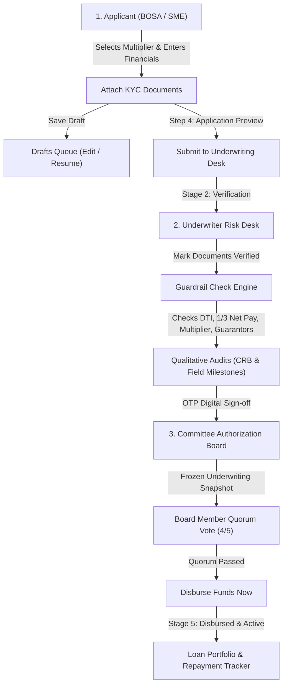

# Talanton Trust Engine — Project & Handover Documentation

**Live Production URL:** [https://talanton-navy.vercel.app](https://talanton-navy.vercel.app)  
**Deployment URL:** [https://talanton-j56albzih-u19059630-3829s-projects.vercel.app](https://talanton-j56albzih-u19059630-3829s-projects.vercel.app)  
**Supabase Project Reference:** `frecrfuclyadjxgveycu` (`https://frecrfuclyadjxgveycu.supabase.co`)

---

## 1. System Credentials & Role Access

Because SACCO members and staff are vetted offline by cooperative management, public self-signup is disabled. All accounts are managed via `public.profiles` in the database.

| Role | Access URL | Email | Password | Persona & Member ID | Default Responsibilities |
| :--- | :--- | :--- | :--- | :--- | :--- |
| **👤 Applicant** | `/login/applicant` | `applicant@talanton.io` | `Password123!` | **Amina K. Nakamya** `M-8842` | Applies for BOSA / SME credit, uploads KYC documents, previews & submits loans, manages drafts, updates member profile. |
| **🛡️ Underwriter** | `/login/underwriter` | `underwriter@talanton.io` | `Password123!` | **Agaba Collins** `U-0104` | Verifies compliance files, runs the Guardrail Check Engine, modifies policy overrides, reviews CRB & Field Audits, signs off via OTP. |
| **🏛️ Committee** | `/login/committee` | `committee@talanton.io` | `Password123!` | **Dr. Ochieng (Chairperson)** `C-0001` | Reviews frozen underwriting stats snapshots, casts quorum votes (4/5 required), executes fund disbursements, monitors active loan book. |

> [!TIP]
> **Instant Login**: On the login pages, leaving the email and password blank and clicking **"Sign in"** will automatically authenticate with the default demo account for that portal.

---

## 2. End-to-End Credit Pipeline Flow

---

## 3. Detailed Component Breakdown

### 👤 Applicant Portal (`/dashboard/applicant`)
1. **Loan Request Wizard (4-Step Flow)**:
   - **Step 1: Classification**: Toggle between *BOSA Member* (individual salary/savings anchor) and *SME Growth Business*. Choose Capital Multiplier (2.0x to 5.0x) with real-time cap bound calculations.
   - **Step 2: Financials**: Enter savings balance, monthly revenue, debt deductions, and tenure (months). Live estimation of DTI ratio and maximum savings cap.
   - **Step 3: Documents & Compliance**: Slot-based document attachment (National ID, Payslip/Ledger, Guarantor Consent). Features a 1-click OCR auto-fill simulation.
   - **Step 4: Application Preview**: Complete summary review of borrower identity, requested terms, and attached files before committing.
2. **Drafts vs Active Loans Separation**:
   - Clicking **"Save Draft"** stores progress with status `Draft`.
   - Saved drafts appear in a dedicated section on the Applicant Dashboard with a **"Resume & Submit"** action.
   - Submitted applications appear on the **Submitted Loan Applications** tab with real-time progress indicators (*Document Verification* &rarr; *Risk Desk Audit* &rarr; *Committee Quorum* &rarr; *Disbursed*).
3. **Account & Settings Tab**:
   - Displays full member personal details (Full Name, Member ID, Physical Address, Phone, Employer/Business, Declared Monthly Income).
   - Features the **Upcoming Feature: Smart OCR Document Form Autofill** banner.

### 🛡️ Underwriter Risk Desk (`/dashboard/underwriter`)
1. **Document Verification**: Click-to-verify action buttons that immediately update document status and sync with the applicant's view.
2. **Underwriting Guardrail Check Engine**:
   - **Deposit Multiplier Bound**: Validates requested principal against the multiplier cap ($Savings \times Multiplier$).
   - **1/3 Statutory Net-Pay Check**: Ensures residual take-home pay after loan deduction satisfies the legal minimum 1/3 gross salary requirement.
   - **Guarantor & Share Coverage Check**: Calculates social collateral requirement ($\max(0, \text{Principal} - \text{Savings})$) and tracks pledged guarantor shares.
   - **Live Parameter Overrides**: Sliders to adjust approved principal, multiplier, tenure, and savings base in real-time.
3. **Credit Officer Qualitative Audits**:
   - **CRB Record**: Displays Credit Reference Bureau score (e.g. 685/900) and *Category B: Minor Delinquencies (< 30 Days)* audit status.
   - **On-Site Field Audit Milestones**:
     - *Character*: KYC verified, market association references passed.
     - *Capacity*: OCR reconstructed revenue matches declared flows.
     - *Collateral*: Business stocks or social assets physically validated.
4. **Digital Sign-Off**: Appraisal Officer OTP digital signature and one-click routing to the Committee Board.

### 🏛️ Committee Board Quorum (`/dashboard/committee`)
1. **Verified Underwriting Stats (Frozen Snapshot)**:
   - Displays a locked snapshot of Applicant Loan, DTI %, Savings Multiplier, and the Underwriter's Audit Verdict (`APPROVED` / `DECLINED`).
   - Includes official board note: *"These stats are frozen snapshots from the underwriting phase. Overrides are restricted to appraisal officers."*
2. **Board Quorum Voting Board**:
   - Interactive voting controls (**Approve**, **Reject**, **Abstain**) for 5 board roles: *Chairperson*, *Risk Head*, *Credit Officer*, *Treasurer*, and *Board Member*.
   - Live Quorum Tracker requiring at least 4 out of 5 approvals (`BOARD APPROVED (QUORUM PASSED)`).
3. **Fund Disbursement & Portfolio Tracker**:
   - Active **"Disburse Funds Now"** action when quorum passes.
   - Logs the exact disbursement timestamp (`disbursedAt`) and transitions the file to `DISBURSED (ACTIVE)` in the **Disbursed Loan Portfolio & Repayment Tracker**.

---

## 4. What Has Been Done (Completed)

- [x] **Supabase PostgreSQL Schema (`supabase-schema.sql`)**: Full DDL for `profiles`, `loan_applications`, `application_documents`, `guarantors`, `committee_votes`, `credit_passports`, `portfolio_loans`, and `storage.buckets`.
- [x] **Supabase Client & Service Layer (`lib/supabase.ts`, `lib/api-service.ts`)**: Resilient API client with automatic failover to local browser persistence.
- [x] **Storage Bucket Setup**: S3-compatible document uploads wired into `uploadDocumentToStorage()`.
- [x] **Landing Page & Branding**: Standardized branding to **Talanton**, fixed all hydration issues, and resolved nested `<button>` conflicts.
- [x] **Separated Views**: Clean dark green (`#0d2a1c`) sidebars, light gray (`#f4f5f4`) content areas, completely separated tabs for Dashboard, Reviews, Creditors, and Settings across all roles.
- [x] **Filtered Views**: Applicant views strictly show the logged-in member's loans; Underwriter and Committee see the global active pipeline.
- [x] **Production Deployment**: Verified clean `npm run build` and deployed live to **Vercel** (`talanton-navy.vercel.app`).

---

## 5. Architectural Assumptions & Current Constraints

1. **No Public Self-Registration**:
   - *Assumption*: SACCOs vet and register members offline. Accounts and roles are pre-seeded in `public.profiles`.
2. **Pre-Seeded Roles**:
   - The system assumes 3 primary personas: Applicant (`M-8842`), Underwriter (`U-0104`), and Committee Member (`C-0001`).
3. **Simulated OTP Digital Sign-off**:
   - The underwriter's signature is currently simulated as an OTP verification stamp (`OTP Signed (Verified)`).
4. **Smart OCR Autofill**:
   - Document OCR extraction is flagged as an upcoming feature with an interactive preview/simulation button.

---

## 6. Pipeline Logic Ambiguities & Clarification Points

> [!IMPORTANT]
> The following questions highlight core business logic rules that require operational clarification:

1. **Underwriter Parameter Overrides vs Applicant Consent**:
   - When an Underwriter modifies an application (e.g., reducing requested principal from UGX 15,000,000 to UGX 10,000,000 or adjusting the tenure):
     - *Question*: Does the applicant need to log in and **accept the revised counter-offer** before it routes to the Committee, or does the Underwriter's appraised amount automatically get forwarded to the Board?

2. **Underwriter Declined Verdicts & Committee Board Visibility**:
   - If a loan fails guardrail checks (e.g., DTI breach or collateral deficit) and the Underwriter signs off with a `DECLINED` verdict:
     - *Question*: Should the declined application still route to the Committee Board for an **override / board appeal**, or should it terminate immediately at the Underwriting desk?

3. **Guarantor Share Locking**:
   - When a guarantor pledges shares (e.g. Kato Joseph pledges UGX 8,000,000 shares):
     - *Question*: Should those pledged shares be automatically deducted from `available_shares` and locked against other loan requests until the borrower completes repayment?

4. **Committee Veto Powers vs Simple 4/5 Quorum Count**:
   - The system requires 4 out of 5 board approvals to pass quorum:
     - *Question*: Does any specific board role (e.g. **Chairperson** or **Risk Head**) have absolute veto power (a single reject blocks the file), or is it strictly determined by total vote count (any 4 approvals)?

5. **Disbursement Authorization Role**:
   - Once a loan receives 4/5 board approvals:
     - *Question*: Can **any** logged-in Committee member click **"Disburse Funds Now"**, or must disbursement be restricted exclusively to the **Treasurer** / **Chairperson**?
